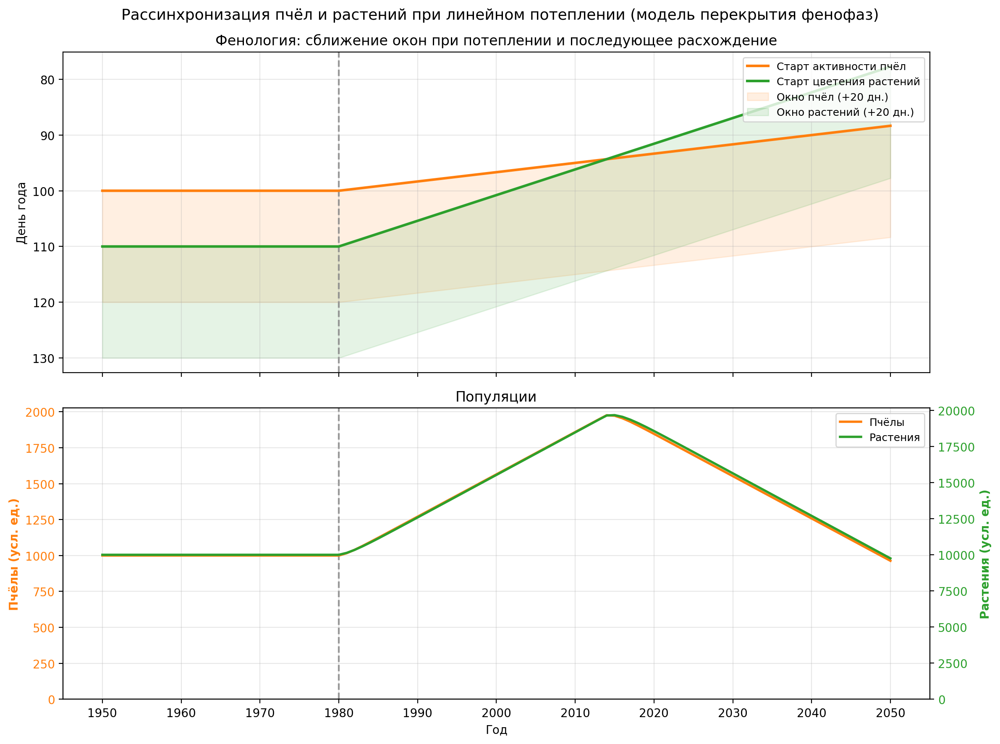
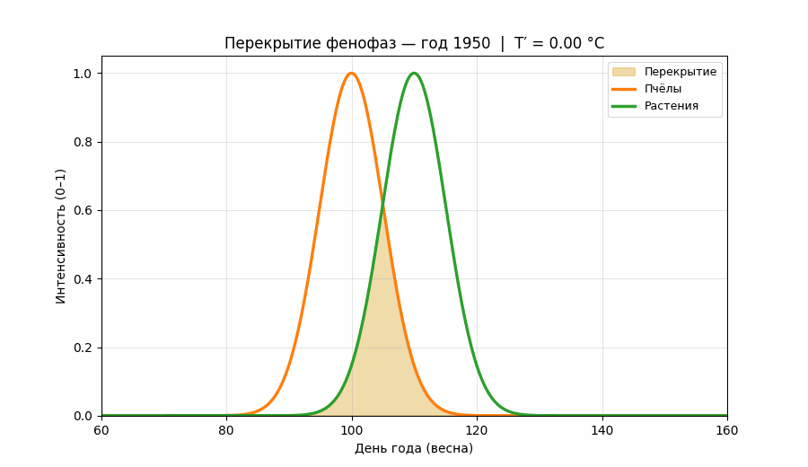
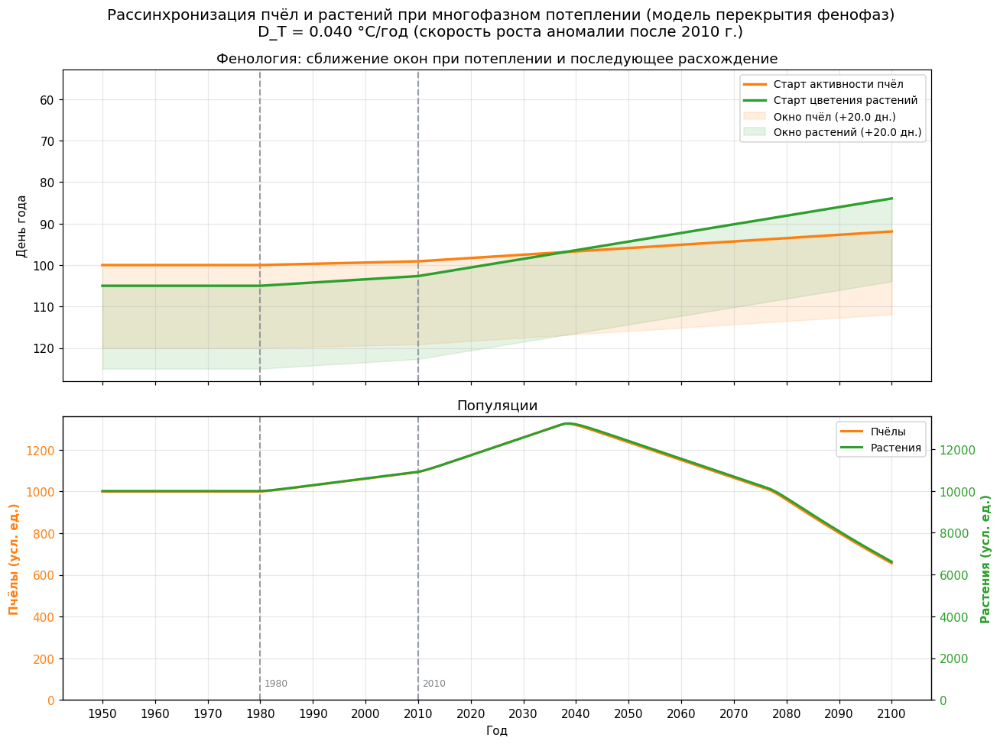

# Симуляция рассинхронизации цветения растений и активности пчёл

Кратко: математическая модель, которая прогнозирует динамику численности популяций пчёл и растений под влиянием климатических факторов (изменения температуры). Основной фокус — влияние потепления на **фенологический сдвиг**, то есть на синхронизацию времени цветения растений и пробуждения пчёл, на горизонте **1950–2100** годов.

---

## Теоретическая база

- **Температурная чувствительность фенологии** (в том числе в пересчёте на день активности на градус изменения температуры) и эмпирические закономерности синхронности растений и опылителей опираются на литературу, в частности на работу:  
  Freimuth J, Bossdorf O, Scheepens JF, Willems FM. 2022. *Climate warming changes synchrony of plants and pollinators.* Proceedings of the Royal Society B. DOI: [10.1098/rspb.2021.2142](https://doi.org/10.1098/rspb.2021.2142)  
  ([страница журнала](https://royalsocietypublishing.org/doi/10.1098/rspb.2021.2142))

- **Исторические скорости потепления** и контекст рядов температуры согласуются с подходами и данными **Climate Research Unit (CRU)**, Университет Восточной Англии:  
  [CRU — данные и документация](https://crudata.uea.ac.uk/cru/data/temperature/)

Параметры чувствительности и кусочно-линейный сценарий аномалии температуры в коде задаются явно.

---

## Логика модели

Модель связывает **температурную аномалию** со **сдвигом дней начала** фенофаз пчёл и растений, вычисляет **перекрытие** окон активности и через него — **мультипликатор численности** популяций с учётом релаксации к целевым значениям по годам.

1. **Историческая (эволюционная) норма**  
   Пчёлы пробуждаются **раньше** начала цветения растений; перекрытие ограничено, популяции находятся в режиме, заданном базовым перекрытием.

2. **Сближение**  
   Растения сильнее реагируют на рост температуры (более отрицательный наклон сдвига дня старта), чем пчёлы; окна цветения и активности **сближаются**, перекрытие растёт.

3. **Идеальная синхронизация**  
   Пики активности **совпадают** в смысле максимального перекрытия окон; это даёт резкий рост множителя численности — условный **«бум»** популяций.

4. **Рассинхронизация**  
   При дальнейшем потеплении растения смещаются ещё раньше относительно пчёл, **разрыв** между цветением и пробуждением увеличивается, перекрытие падает и популяции **стремительно снижаются** (в тяжёлых случаях — к коллапсу).

Реализация ядра симуляции и комментарии к уравнениям: модуль `phenology_overlap_simulation.py` (горизонт 1950–2100, кусочно-линейная аномалия *T*, линейные фенофазы, прямоугольные окна активности, динамика популяций).

---

## Технический стек и визуализации

| Компонент | Назначение |
|-----------|------------|
| **Python 3** | язык реализации |
| **NumPy**, **pandas** | численные ряды и табличные результаты по годам |
| **Matplotlib** | статические графики и кадры для анимаций |
| **Streamlit** | интерактивные дашборды для подбора гипотез и параметров |
| **Plotly** | интерактивная графика в одном из дашбордов |
| **Pillow** | сборка GIF из кадров |

**Сценарий после 2025:** в базовой постановке после ускорения потепления (с 2010 г.) используется фиксированный рост аномалии температуры **0,04 °C в год** (константа `D_T` в `phenology_overlap_simulation.py`); в отдельном дашборде скорость после 2010 г. можно менять в диапазоне ползунком.

**Статические и анимированные артефакты в репозитории:**

- `phenology_overlap_results.png` — сводный график результатов симуляции (при запуске скрипта ядра).
- `phenology_mismatch.gif` — анимация сдвига пиков и перекрытия фенофаз.
- `phenology_overlap_dt.gif` — наглядная демонстрация влияния скорости потепления на динамику и «ускорение» кризисных режимов.

### Превью

Сводный график (`phenology_overlap_simulation.py` → PNG):



Анимация сдвига фенофаз и перекрытия:



Влияние скорости потепления (разные значения `D_T`):



**Интерактивные приложения Streamlit:**

- `phenology_mismatch.py` — дашборд с **Plotly** для исследования модели перекрытия фенофаз.
- `phenology_overlap_dt.py` — дашборд с ползунком скорости потепления **D_T** (°C/год после 2010 г.) и экспортом GIF.

**Пакетный запуск ядра без Streamlit:**

```bash
python3 phenology_overlap_simulation.py
```

(печать фрагментов таблицы, сводка в консоль, сохранение PNG при вызове построения графика в скрипте).

---

## Локальный запуск
Ветка **feature/math-modeling** содержит подробную документацию и материалы по **математическому моделированию** проекта: постановка модели, теоретическая база, описание симуляций и интерактивные дашборды.

```bash
git checkout feature/math-modeling
```

### 1. Клонирование репозитория

```bash
git clone https://github.com/seym0/bee-plant-simulation.git
cd bee-plant-simulation
```

При работе с веткой **math-modeling** переключитесь на неё:

```bash
git checkout math-modeling
```

### 2. Виртуальное окружение

```bash
python3 -m venv .venv
```

**Активация:**

- macOS / Linux: `source .venv/bin/activate`
- Windows: `.venv\Scripts\activate`

### 3. Установка зависимостей

```bash
pip install -r requirements.txt
```

### 4. Запуск Streamlit

Интерактивный дашборд с Plotly (модель рассинхронизации / перекрытия):

```bash
streamlit run phenology_mismatch.py
```

Дашборд с настройкой скорости потепления и экспортом GIF:

```bash
streamlit run phenology_overlap_dt.py
```

После запуска откройте в браузере адрес, который покажет Streamlit (обычно `http://localhost:8501`).

---

*Ветка math-modeling: математическое моделирование экосистемы «пчёлы — растения — климат».*
